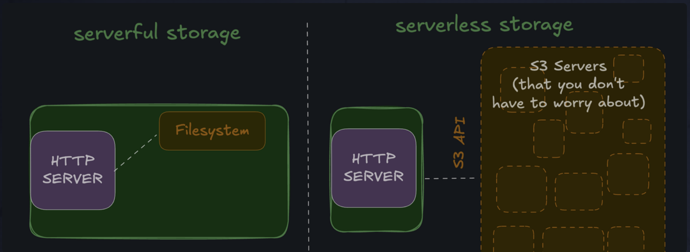
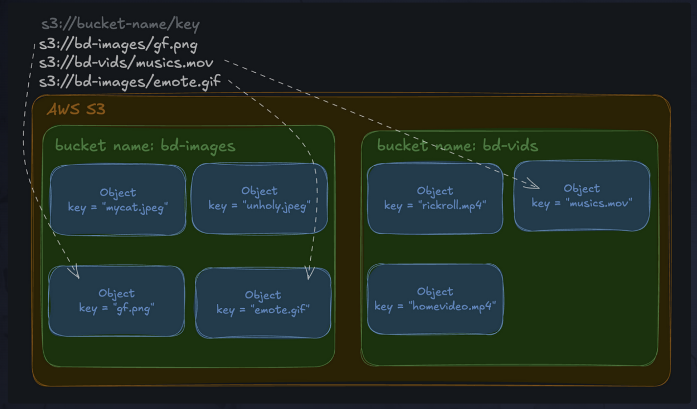

# learn-file-storage-s3-typescript-starter (Tubely)

This repo contains the starter code for the Tubely application - the #1 tool for engagement bait - for the "Learn File Servers and CDNs with S3 and CloudFront"

## Quickstart

## 1. Install dependencies

- [Typescript](https://www.typescriptlang.org/)
- [Bun](https://bun.sh/)
- [FFMPEG](https://ffmpeg.org/download.html) - both `ffmpeg` and `ffprobe` are required to be in your `PATH`.

```bash
# linux
sudo apt update
sudo apt install ffmpeg

# mac
brew update
brew install ffmpeg
```

- [SQLite 3](https://www.sqlite.org/download.html) only required for you to manually inspect the database.

```bash
# linux
sudo apt update
sudo apt install sqlite3

# mac
brew update
brew install sqlite3
```

- [AWS CLI](https://docs.aws.amazon.com/cli/latest/userguide/getting-started-install.html)

## 2. Download sample images and videos

```bash
./samplesdownload.sh
# samples/ dir will be created
# with sample images and videos
```

## 3. Configure environment variables

Copy the `.env.example` file to `.env` and fill in the values.

```bash
cp .env.example .env
```

You'll need to update values in the `.env` file to match your configuration, but _you won't need to do anything here until the course tells you to_.

## 3. Run the server

```bash
bun run src/index.ts
```

- You should see a new database file `tubely.db` created in the root directory.
- You should see a new `assets` directory created in the root directory, this is where the images will be stored.
- You should see a link in your console to open the local web page.

## LEARNING NOTES

<details>
<summary>Why do web applications need to handle large files?</summary>

Building a (good) web application almost always involves handling "large" files of some kind - whether it's static images and videos for a marketing site, or user generated content like profile pictures and video uploads, it always seems to come up.

In this project we'll cover strategies for handling files that are kilobytes, megabytes, or even gigabytes in size, as opposed to the small structured data that you might store in a traditional database (integers, booleans, and simple strings).

</details>

## Learning Goals

<details>
<summary>Learning Goals</summary>

- Understand what "large" files are and how they differ from "small" structured data
- Build an app that uses AWS S3 and Typescript to store and serve assets
- Learn how to manage files on a "normal" (non-s3) filesystem based application
- Learn how to store and serve asset AT SCALE using serverless solutions, like AWS S3
- Learn how to stream video and to keep data usage low and improve performance

</details>

## Large files

<details>
<summary>What are "large files" or "large assets"?</summary>

- "Large files" (or "large assets") are big blobs of data, usually encoded in a specific file format, and measured in kilobytes, megabytes, or gigabytes.

**As a simple rule:**

- If the data makes sense in an Excel spreadsheet, it probably belongs in a traditional database.
- If the data would normally be stored on your hard drive as its own file, it's probably a "large file".

**Large files are interesting because:**

- They are large in size (obviously), making them more performance-sensitive.
- They are often accessed frequently, and their size combined with frequent access can quickly lead to performance bottlenecks.

</details>

# Encoding

- we can actually encode the image as a `base64` string and shove the whole thing into a text column in SQLite.
  Base64 is just a way to encode binary (raw) data as text. It's not the most efficient way to do it, but it will work for now.

# Using the Filesystem

<details>
<summary>Why not store images as base64 in SQLite?</summary>

We're using `base64` strings in our SQLite database to store images... let's talk about why that actually kinda sucks:

1. **CPU performance:** Base64 encoding is an expensive, CPU-intensive operation. If we have a lot of uploads (and we're hoping to be successful, right?), this can become a real scaling issue.
2. **Storage costs:** Base64 encoding increases the size of the image data. We're using more disk space than necessary, which is both expensive and slow.
3. **Database performance:** Databases (especially relational databases like SQLite, Postgres, and MySQL) are optimized for small, structured data—not giant blobs of binary data. This can seriously impact query performance.
4. **Caching:** Base64 encoded images aren't as cache friendly as raw files, meaning slower load times and higher bandwidth costs.

It's usually a bad idea to store large binary blobs in a database. There are exceptions, but they are rare.

**So what's the solution?**  
Store the files on the filesystem! File systems are optimized for storing and serving files—and they do it very well.

</details>

## Mime Types

A mime type is just a web-friendly way to describe format of a file. It's kind of like a file extension, but more standardized and built for the web.

Mime types have a type and a subtype, separated by a /. For example:

image/png
video/mp4
audio/mp3
text/html

When a browser uploads a file via a multipart form, it sends the file's mime type in the Content-Type header.

# CACHE

## Cache Headers

Query strings are a great way to brute force cache controls as the client - but the best way (assuming you have control of the server, and c'mon, we're backend devs), is to use the `Cache-Control` header.

Some common values are:

- no-store: Don't cache this at all

- max-age=3600: Cache this for 1 hour (3600 seconds)

- stale-while-revalidate: Serve stale content while revalidating the cache

- no-cache: Does not mean "don't cache this". It means "cache this, but REVALIDATE it BEFORE SERVING it again"

When the server sends Cache-Control headers, it's up to the browser to respect them, but most modern browsers do.

## "Stale" files are a common problem in web development.

When your app is SMALL, the performance benefits of aggressively caching files might not be worth the complexity and potential bugs that can crop up from not handling CACHE behavior correctly.

After all, the famous quote goes:

### There are only two hard things in Computer Science: cache invalidation, naming things, and off-by-one errors.

In Tubely, we just don't care about old versions of thumbnails. Like ever. So let's just give each new thumbnail version a completely new URL (and path on the filesystem). That way, we can avoid all potential caching issues completely.

## Serverless

"Serverless" is an architecture (and let's be honest, a buzzword) that refers to

a SYSTEM WHERE you don't have to manage the servers on your own.

Serverless is largely misunderstood due to the dubious naming.

It does not mean there are no servers, it just means they're someone else's problem.

You'll often see "Serverless" used to describe services like AWS Lambda, Google Cloud Functions, and Azure Functions. And that's true, but it refers to "serverless" in its most "pure" form: serverless compute.

## AWS S3

AWS S3 was actually one of the first "serverless" services, and is arguably still the most popular.

It's not serverless compute, it's serverless STORAGE.

You don't have to manage/scale/secure the servers that STORE YOUR FILES, AWS does that for you.

Instead of going to a local file system, your server makes network requests to the S3 API to read and write files.



### S3 Architecture

File A goes in bucket B at key C. That's it.

You only need 2 things to access an object in S3:

- The bucket name

- The object key

Buckets have globally unique names because they are part of the URL used to access them.

If I make a bucket called "bd-vids", you can't make a bucket called "bd-vids", even if you're in a separate AWS account. This makes it really easy to think about where your data lives.



### SDKs and S3

An SDK or "Software Development Kit" is just a collection of tools (often involving an importable library) that helps you interact with a specific service or technology.

AWS has official SDKs for most popular programming languages. They're usually the best way to interact with AWS services.

# OBJECT STORAGE

## Traditional File Storage

"File storage" is what you're already familiar with:

Files are stored in a hierarchy of directories

A file's system-level metadata (like timestamp and permissions) is managed by the file system, not the file itself

File storage is great for SINGLE-machine-use (like your laptop), but it doesn't distribute well across many servers.

It's optimized for low-latency access to a small number of files on a SINGLE machine.

## Object Storage

Object storage is designed to be more SCALABLE, AVAILABLE, and DURABLE than file storage because it can be easily distributed across many machines:

- Objects are stored in a flat namespace (no directories)

- An object's metadata is stored with the object itself

## File System Illusion

Directories are really great for organizing stuff. Storing everything in one giant bucket makes a big hard-to-manage mess. So, S3 makes your objects feel like they're in directories, even though they're not.

### It's Just Prefixes

Keys inside of a bucket are just strings. And strings can have slashes, right? Right.

If you upload an object to S3 with the key users/john/profile.jpg, we can kind of pretend that the object is in a directory called users and a subdirectory called john. Not only that, but the S3 API actually provides tools that allow this illusion to thrive.

Let's say I create some objects with keys:

users/dan/profile.jpg
users/dan/friends.jpg
users/lane/profile.jpg
users/lane/friends.jpg
people/matt/profile.jpg

Then I can use the S3 API to list all the objects with the key prefix users/lane. It returns:

users/lane/profile.jpg
users/lane/friends.jpg

or just everything with the prefix "users":

users/dan/profile.jpg
users/dan/friends.jpg
users/lane/profile.jpg
users/lane/friends.jpg

It feels like a hierarchy, without all the technical overhead of actually creating directories.

## Dynamic Path

Although directories are an illusion in S3, they're still USEFUL due to the PREFIX filtering capabilities of the S3 API.

There are a lot of common strategies for organizing objects in S3, but the most important rule is:

`Organization matters.`

SCHEMA ARCHITECTURE matters in a SQL database, and PREFIX architecture matters in S3.

We always want to GROUP objects in a way that makes sense for our case, because often we'll want to OPERATE on a group of objects at once.

For example, pretend you do the naive thing and upload all your images to the root of your bucket. What happens if...

- you want to delete all the images for a specific user?
- a feature changed and you need to resize all the images it uses?
- you want to change the permissions of all the images associated with a specific organization?

If you don't have any prefixes (directories) to group objects, you might find yourself iterating over every object in the bucket to find the ones you care about. That's slow and expensive.

# Streaming

NO one is on dial-up 256k modems, we typically don't worry about "streaming" smaller files like images.

GIANT audio files (like audio books), and especially large video files should be streamed rather than downloaded. At least if you want your user to be able to start consuming the content immediately.

## Streaming vs. Downloading

- Downloading is when you WAIT for the ENTIRE file to be transferred BEFORE you can start using it.

- Streaming is when you start USING the file immediately while it's STILL BEING transferred in the background.

The simplest way to stream a video file on the web (imo) is to take advantage of two things:

The native HTML5 <video> element. It STREAMS video files by DEFAULT as long as the server supports it.

The Range HTTP header. It allows the client to request specific byte ranges of a file, enabling partial downloads. 

S3 servers support it by default.

- A 206 status code means "Partial Content" - that's because the browser is smart enough to realize that it should not download the entire 100MB+ video before starting to play it. It's downloading just enough to start playing the MP4 file.

# Security 

Cloud security is a giant can of worms. This isn't a security course, but I do want to give you a few pointers to keep you safe with a simple setup while using S3. A few things to think about:

1. WHO can access your bucket, and which parts of your bucket can they access?
2. What ACTIONS can they take?
3. HOW are they authenticated? And from where can they authenticate?

At the moment, in your Tubely app:

- Your bucket is publicly accessible. Anyone can get any individual object in your bucket.

- Anyone can get the objects in your bucket, but only Tubely (and you) can change them or list them.

- Public readers aren't authenticated, but your code is authenticated with your AWS IAM access key.

## Keys Aren't Enough

While it's great that an attacker would need to steal your AWS credentials to be able to maliciously change the contents of your bucket, relying only on the secrecy of keys is often not enough.

Keys and passwords are compromised all the time.

One way to add an additional layer of security is to ensure that your keys can only be used from certain (virtual) locations. 

Then an attacker would need your keys and to be on your network to gain access.

## Scoping Permission 

A critical rule of thumb in cyber security is `the principle of least privilege`: 
You should allow the fewest permissions possible that can still get the job done.

For example, your user is in the "manager" group which we gave "full admin access" to. 

Especially at smaller companies, it's common for folks to have more permissions than they truly need, usually for the sake of SPEED and CONVENIENCE.

But that's NOT the most secure way to do things.

Let's just pretend that you are the engineering manager, that Tubely is a small company, and so it does make sense for your IAM user to have full admin access.

Fine.

But that doesn't mean we can't still scope down the permissions of the application itself.
